# Przepływy Użytkownika – Floowe

Niniejszy dokument opisuje kluczowe przepływy użytkownika w aplikacji Floowe.  
Każdy przepływ pokazuje interakcję pomiędzy użytkownikiem a systemem oraz wynik biznesowy dostarczany przez platformę.

## Diagram Wizualny

---

## Przepływ 1: Onboarding i Konfiguracja

**Kroki:**

1. Użytkownik rejestruje się i tworzy konto
2. Użytkownik definiuje kontekst marki (styl komunikacji, grupę docelową, słowa kluczowe)
3. Użytkownik łączy konta w mediach społecznościowych (Facebook, LinkedIn, X)
4. System zapisuje konfigurację i włącza funkcję publikowania

**Rezultat:**  
Konto użytkownika jest w pełni skonfigurowane i gotowe do generowania oraz publikowania treści.

---

## Przepływ 2: Generowanie Treści

**Kroki:**

1. Użytkownik wybiera opcję „Generate Content”
2. System analizuje aktualne trendy oraz powiązane słowa kluczowe
3. AI proponuje pomysły na artykuły
4. Użytkownik wybiera preferowany temat
5. System generuje pełny szkic artykułu zoptymalizowany pod SEO

**Rezultat:**  
Szkic artykułu zostaje automatycznie wygenerowany i jest gotowy do edycji.

---

## Przepływ 3: Edycja i Wzbogacanie Treści

**Kroki:**

1. Użytkownik przegląda szkic artykułu w edytorze WYSIWYG
2. Użytkownik edytuje ton, strukturę oraz treść artykułu
3. Użytkownik wybiera lub przesyła obrazy (generowane przez AI, z banków zdjęć lub własne)
4. System zapisuje zmiany i przygotowuje finalną wersję artykułu

**Rezultat:**  
Dopracowany artykuł gotowy do publikacji z zachowaniem modelu **human-in-the-loop** (udział użytkownika w procesie).

---

## Przepływ 4: Publikacja i Dystrybucja

**Kroki:**

1. Użytkownik klika przycisk „Publish”
2. System publikuje artykuł poprzez integrację ze stroną internetową
3. System automatycznie generuje dopasowane posty do mediów społecznościowych
4. System dystrybuuje posty we wszystkich połączonych kanałach

**Rezultat:**  
Treść zostaje opublikowana na stronie internetowej oraz w mediach społecznościowych przy minimalnym wysiłku użytkownika.

---

## Przepływ 5: Pętla Wzrostu SEO (Funkcja Przyszłościowa / TO-BE)

**Kroki:**

1. Opublikowana treść zostaje zaindeksowana przez wyszukiwarki
2. Słowa kluczowe SEO zwiększają widoczność w wynikach wyszukiwania
3. Ruch organiczny stopniowo rośnie
4. Użytkownik pozyskuje nowych odbiorców i potencjalnych klientów

**Rezultat:**  
Stały wzrost ruchu organicznego dzięki regularnej publikacji treści.
