🇵🇱 Polish version → [Zobacz wersję polską](../pl/02-user-flows-PL.md)

---

# User Flows – Floowe

This document describes the key user flows in Floowe.  
Each flow shows the interaction between the user and the system, as well as the business outcome delivered by the platform.

## Visual Diagram

---

## Flow 1: Onboarding & Setup

**Steps:**

1. User registers and creates an account
2. User defines brand context (voice, audience, keywords)
3. User connects social media accounts (Facebook, LinkedIn, X)
4. System saves configuration and enables publishing functionality

**Outcome:**  
User account is fully configured and ready for content generation and publishing.

---

## Flow 2: Content Generation

**Steps:**

1. User clicks "Generate Content"
2. System analyzes trending topics and relevant keywords
3. AI proposes article ideas
4. User selects preferred topic
5. System generates a full SEO-optimized draft

**Outcome:**  
Draft article generated automatically and ready for editing.

---

## Flow 3: Edit & Enrich

**Steps:**

1. User reviews draft in WYSIWYG editor
2. User edits tone, structure, and wording
3. User selects or uploads images (AI-generated, stock, custom)
4. System updates and prepares the final version

**Outcome:**  
Polished article ready for publishing with human-in-the-loop refinement.

---

## Flow 4: Publish & Distribute

**Steps:**

1. User clicks "Publish"
2. System publishes article via website integration
3. System automatically generates social media posts
4. System distributes posts across connected channels

**Outcome:**  
Content is published across website and social media channels with minimal manual effort.

---

## Flow 5: SEO Growth Loop (Future / TO-BE)

**Steps:**

1. Published content becomes indexed by search engines
2. SEO keywords improve search visibility
3. Organic traffic increases over time
4. User gains leads and audience growth

**Outcome:**  
Compounding organic traffic growth through consistent content publishing.

---
