🇵🇱 Polish version → [Zobacz wersję polską](../pl/03-event-storming.md)

---
# Event Storming – Floowe

This document presents an Event Storming analysis of the Floowe product, identifying the key domain events, commands, actors and external systems involved in the content creation and distribution workflow.

The analysis was initially supported by Claude AI and refined based on previously identified user flows.

---

# Actors

- User
- AI Content Engine (system actor)

---

# Commands

- Register Account
- Save Brand Profile
- Link Social Channels
- Generate Article
- Edit Article
- Attach Image
- Approve Article
- Publish Article
- Distribute Content

---

# Domain Events

## Onboarding Domain
- Account Created
- Brand Profile Saved
- Channels Linked

## Content Generation Domain
- Article Generation Requested
- Draft Article Created

## Editing Domain
- Article Edited
- Image Attached
- Article Approved

## Publishing Domain
- Article Published
- Social Posts Generated

## Distribution Domain
- Social Post Published
- Content Distributed
- SEO Loop Started

---

# External Systems

- AI Content Engine
- Website CMS
- Facebook API
- LinkedIn API
- X (Twitter) API
- Search Engines

---

# Domain Boundaries

## 1. Onboarding
User creates an account, defines brand context and connects social channels.

Key dependency: Channels must be linked before publishing can occur.

## 2. Content Generation
The AI system generates an SEO-optimized draft based on the user command.

The event **Draft Article Created** triggers the rest of the workflow.

## 3. Editing
The user refines the content and attaches images.  
The event **Article Approved** acts as a gate before publishing.

## 4. Publishing
Publishing triggers two processes:

- publishing to CMS
- generation of social posts

These actions may run asynchronously.

## 5. Distribution
Content is distributed across multiple social platforms through API integrations.

Terminal events include **Content Distributed** and **SEO Loop Started**, representing the business outcome of the system.

---

# Event Storming Diagram

```mermaid
flowchart LR

  %% ── Styles ──────────────────────────────────────────
  classDef actor    fill:#EEEDFE,stroke:#AFA9EC,color:#3C3489,font-weight:600
  classDef command  fill:#E6F1FB,stroke:#85B7EB,color:#0C447C,font-weight:600
  classDef event    fill:#FAEEDA,stroke:#EF9F27,color:#633806,font-weight:600
  classDef external fill:#E1F5EE,stroke:#5DCAA5,color:#085041,font-weight:600
  classDef domain   fill:#F1EFE8,stroke:#B4B2A9,color:#5F5E5A,font-weight:700

  %% ════════════════════════════════════════════════════
  %% DOMAIN 1 — ONBOARDING
  %% ════════════════════════════════════════════════════
  subgraph D1["① Onboarding"]
    direction TB
    U1(["User"]):::actor

    C1["Register Account"]:::command
    C2["Save Brand Profile"]:::command
    C3["Link Social Channels"]:::command

    E1(["Account Created"]):::event
    E2(["Brand Profile Saved"]):::event
    E3(["Channels Linked"]):::event

    U1 --> C1 --> E1 --> C2 --> E2 --> C3 --> E3
  end

  %% ════════════════════════════════════════════════════
  %% DOMAIN 2 — CONTENT GENERATION
  %% ════════════════════════════════════════════════════
  subgraph D2["② Content Generation"]
    direction TB
    U2(["User"]):::actor
    SYS1[["AI Content Engine"]]:::external

    C4["Generate Article"]:::command

    E4(["Article Generation Requested"]):::event
    E5(["Draft Article Created"]):::event

    U2 --> C4 --> E4 --> SYS1 --> E5
  end

  %% ════════════════════════════════════════════════════
  %% DOMAIN 3 — EDITING
  %% ════════════════════════════════════════════════════
  subgraph D3["③ Editing"]
    direction TB
    U3(["User"]):::actor

    C5["Edit Article"]:::command
    C6["Attach Image"]:::command
    C7["Approve Article"]:::command

    E6(["Article Edited"]):::event
    E7(["Image Attached"]):::event
    E8(["Article Approved"]):::event

    U3 --> C5 --> E6 --> C6 --> E7 --> C7 --> E8
  end

  %% ════════════════════════════════════════════════════
  %% DOMAIN 4 — PUBLISHING
  %% ════════════════════════════════════════════════════
  subgraph D4["④ Publishing"]
    direction TB
    U4(["User"]):::actor
    SYS2[["Website CMS"]]:::external

    C8["Publish Article"]:::command

    E9(["Article Published"]):::event
    E10(["Social Posts Generated"]):::event

    U4 --> C8 --> E9 --> SYS2
    E9 --> E10
  end

  %% ════════════════════════════════════════════════════
  %% DOMAIN 5 — DISTRIBUTION
  %% ════════════════════════════════════════════════════
  subgraph D5["⑤ Distribution"]
    direction TB
    SYS3[["Facebook API"]]:::external
    SYS4[["LinkedIn API"]]:::external
    SYS5[["X API"]]:::external
    SYS6[["Search Engines"]]:::external

    C9["Distribute Content"]:::command

    E11(["Social Post Published"]):::event
    E12(["Content Distributed"]):::event
    E13(["SEO Loop Started"]):::event

    C9 --> SYS3 --> E11
    C9 --> SYS4 --> E11
    C9 --> SYS5 --> E11
    E11 --> E12 --> SYS6 --> E13
  end

  %% ════════════════════════════════════════════════════
  %% DOMAIN TRANSITIONS (left → right flow)
  %% ════════════════════════════════════════════════════
  E3 -->|triggers| C4
  E5 -->|triggers| C5
  E8 -->|triggers| C8
  E9 -->|triggers| C9
```

---

# Open Questions / Hotspots

During event storming analysis, several system design questions were identified:

- What happens if a social media API call fails during distribution?
- Should publishing retries be implemented automatically?
- Is article approval an explicit user action or implicit after editing?
- Should generated social posts be editable before distribution?

These areas represent potential risks and design considerations for future development.
